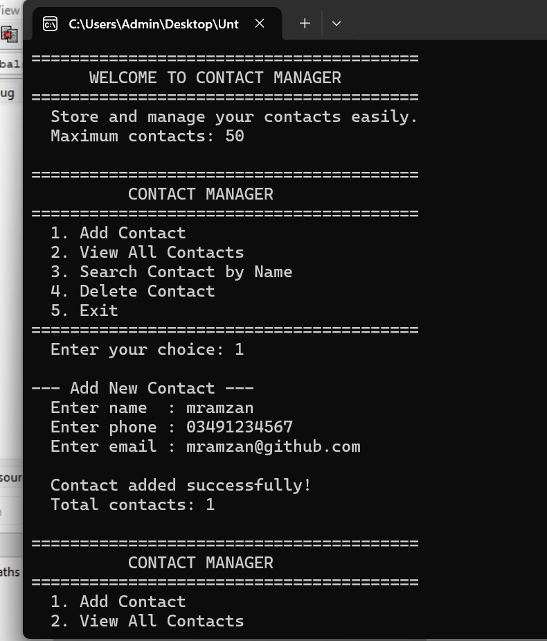
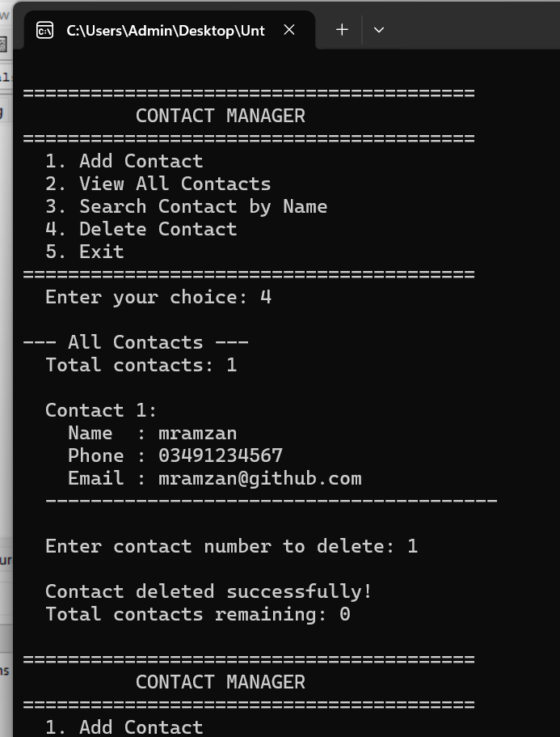

# Contact Manager in C

A console-based contact manager built in C. The user can add, view, search, and delete contacts through a simple menu system. Every contact stores a name, phone number, and email address — all managed through an array of structs.

---

## Screenshots





---

## Why I Built This

My previous projects — Number Guessing Game, Quiz Game, and Hangman — were all about game logic. This project was different. I wanted to build something that felt like a real tool, not just a game. A contact manager is something people actually use and it forced me to think about data management for the first time — how to store information, display it, search through it, and remove it cleanly.

It also introduced me to `fgets()`, `strstr()`, and the struct array pattern that shows up in almost every real C program.

---

## What the Program Does

- Displays a clean menu with 5 options every loop
- Add a contact — stores name, phone, and email
- View all contacts — lists every stored contact with a number
- Search by name — partial search works, typing a few letters finds all matches
- Delete a contact — removes by number and shifts the remaining contacts to fill the gap
- Exit — clean goodbye message

---

## How to Run It

**You need GCC installed. Check with:**
```bash
gcc --version
```

**Compile:**
```bash
gcc contact_manager.c -o contact_manager
```

**Run:**
```bash
./contact_manager
```

---

## How I Built It — 5 Commit History

**Commit 1 — Project structure, Contact struct, and menu system**
Created `contact_manager.c` and defined the `Contact` struct — the first time I used a struct to group related data into one unit. Set up the `contacts[]` array and `contact_count` variable. Built `show_menu()` and the full `do-while` loop with `switch` statement in `main()`. All menu cases showed "Coming soon" placeholders — the skeleton was complete and running from day one.

**Commit 2 — Add contact**
Wrote `add_contact()` and learned two new string functions. `fgets()` reads a full line including spaces — much better than `scanf("%s")` which stops at the first space. `strcspn()` finds and removes the newline character `fgets` always adds at the end. The contact saves directly into `contacts[contact_count]` and then `contact_count++` registers it.

**Commit 3 — View all contacts**
Wrote `view_contacts()` — a simple `for` loop from `0` to `contact_count`. Accessing a struct field inside an array looks like `contacts[i].name` — the `[i]` picks the contact, the `.name` picks the field. Added an empty list check so the function always handles both cases cleanly.

**Commit 4 — Search contact by name**
Wrote `search_contact()` and used `strstr()` for the first time. `strstr(contacts[i].name, search)` checks if the search term appears anywhere inside the contact name. Returns non-NULL if found, NULL if not. One function call, one condition — that is the entire search engine. Partial searches work automatically.

**Commit 5 — Delete contact and finalize**
Wrote `delete_contact()` and learned the shift technique. When a contact is deleted every contact after it moves one position backward using struct assignment — `contacts[i] = contacts[i + 1]` copies an entire struct in one line. Then `contact_count--` reduces the count so the last duplicate slot is ignored. No gaps, no holes, array stays compact.

---

## What I Learned

**`fgets()` over `scanf("%s")`** — `scanf` stops reading at a space so "Muhammad Ramzan" would only store "Muhammad". `fgets()` reads the entire line. That one switch changed how I think about string input in C.

**`strcspn()` for newline removal** — `fgets` always adds `'\n'` at the end of what it reads. `strcspn(string, "\n")` finds where that newline is and replacing it with `'\0'` ends the string cleanly there. Two lines of code, important habit.

**`strstr()` for searching** — I expected searching to be complicated. It turned out to be one function that returns NULL or a pointer. The partial match behavior comes for free — no extra logic needed.

**Struct assignment** — `contacts[i] = contacts[i + 1]` copies every field of the struct in one line. I expected to need a loop to copy each field manually. Struct assignment does it all at once.

**The shift technique for deletion** — deleting from the middle of an array without leaving gaps. Start at the deleted index, copy the next element back, repeat until the end. `contact_count--` finishes it. Clean and simple.

**`switch` statement** — cleaner than a long chain of `if / else if` when checking one variable against multiple fixed values. Each `case` maps directly to a menu option.

---

## Project Structure

```
contact-manager-c/
├── contact_manager.c
├── README.md
└── screenshots/
    ├── menu.png
    └── view-search.png
```

---

## Tech

- **Language:** C (C99)
- **Compiler:** GCC
- **Libraries:** `stdio.h`, `stdlib.h`, `string.h` — standard library only


---

## Connect

[](https://www.linkedin.com/in/muhammad-ramzan-bb63233aa/)
[](mailto:mramzan14700@gmail.com)

---

*Fifth project in my C portfolio. First utility tool — not a game. Built commit by commit as part of learning structs, string functions, and array management in C.*